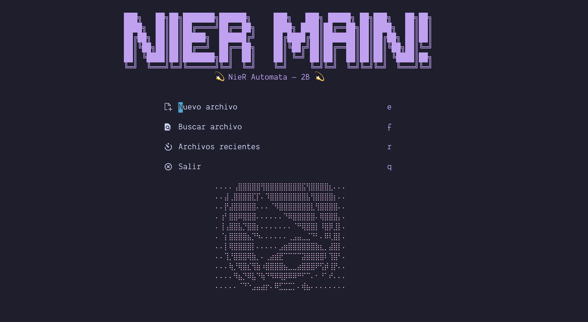
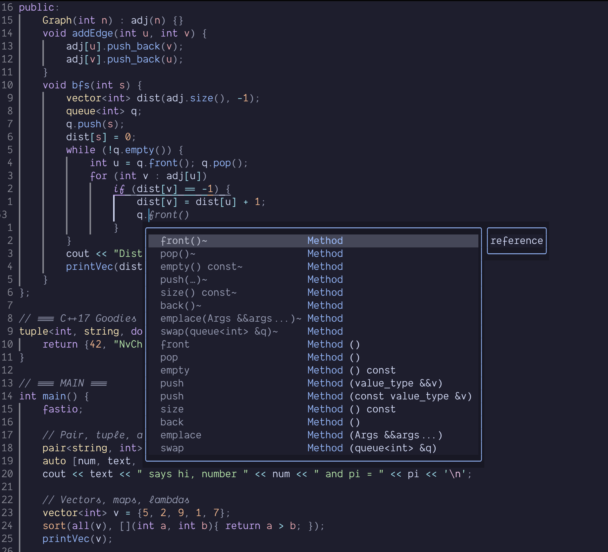

# 💤 NieR Automata 2B — Neovim Config



> 🚀 Configuración **modular, limpia y optimizada** para desarrollo moderno con **Neovim 0.10+**  
> Incluye soporte para **C++**, **Lua**, **TypeScript**, autocompletado inteligente, snippets personalizados  
> y una estética inspirada en **2B de NieR: Automata** ⚔️💎  

---

## ✨ Características principales

- 🧩 **Arquitectura modular** — todo organizado en `lua/` por propósito: LSP, plugins, UI, etc.  
- ⚙️ **Gestión de plugins** mediante [`lazy.nvim`](https://github.com/folke/lazy.nvim) para carga ultra rápida  
- 🎨 **Tema Catppuccin (Mocha)** con integración total en Lualine, Telescope y Alpha  
- 🖼️ **Pantalla de inicio personalizada** (Alpha.nvim) con arte ASCII de *NieR Automata – 2B*  
- 🧠 **LSP integrado** (C++, Lua, TypeScript) con `mason.nvim` + `nvim-lspconfig`  
- 💬 **Autocompletado avanzado** con `nvim-cmp`, `LuaSnip` y `friendly-snippets`  
- 🪶 **Snippets propios para C++** (for loops, ifs, clases, etc.) estilo VSCode  
- 🌳 **Treesitter** para resaltado semántico y plegado inteligente  
- 🔍 **Telescope** para búsquedas rápidas de archivos, texto y buffers  
- 🧱 **Lualine** minimalista con separadores elegantes  
- ⌨️ **Keymaps personalizados** con líder (`<Space>`) para máxima productividad  
- 🖋️ **Tipografía**: *Dank Mono* parcheada con Nerd Fonts *(si la quieres, mándame correo)*  

---

## 🧩 Estructura del proyecto

```bash
~/.config/nvim
├── init.lua
├── lua/
│   ├── basic.lua              # Opciones generales de Neovim
│   ├── keymaps.lua            # Atajos personalizados
│   ├── autocmds.lua           # Autocomandos
│   ├── cmp_settings.lua       # Configuración de nvim-cmp + LuaSnip
│   ├── theme.lua              # Tema Catppuccin + Treesitter
│   ├── plugins.lua            # Definición de plugins (Lazy)
│   ├── lsp/
│   │   ├── init.lua           # Configuración base LSP
│   │   └── servers.lua        # Configuración por lenguaje
│   └── config/
│       ├── alpha.lua          # Dashboard personalizado (2B)
│       └── lualine.lua        # Barra de estado
├── templates/
│   └── init.lua               # Plantillas para programación competitiva
└── README.md
```

---

## 🔮 Preview de código



---

## 🚀 Instalación

### 🔧 Dependencias

#### macOS
```bash
brew install neovim git node clangd lua luarocks ripgrep fd
```

#### Linux (Debian/Ubuntu)
```bash
sudo apt install neovim git nodejs clangd lua5.4 luarocks ripgrep fd-find
```

---

### 📦 Instalación del entorno

```bash
git clone https://github.com/EmmaG2/nvim-config ~/.config/nvim
nvim
```

Al abrir Neovim por primera vez, **lazy.nvim** descargará automáticamente todos los plugins y configuraciones.

---

## 🧠 Soporte LSP (C++ / Lua / TypeScript)

El entorno incluye configuración de **clangd**, **lua-language-server**, y **typescript-language-server**.  
Para que clangd reconozca headers globales como `bits/stdc++.h`, crea este archivo:

**`~/.config/clangd/config.yaml`**
```yaml
CompileFlags:
  Add: [-std=c++17, -I/Library/Developer/CommandLineTools/usr/include]
```

Verifica que clangd lea tu configuración:
```bash
clangd --check=.
```

---

## 🎨 Recomendaciones visuales

- Tema sugerido: **Catppuccin Mocha**
- Fuente: **Dank Mono Nerd Font**
- Terminal: **Warp** o **Alacritty** con ligaduras activadas  
- Activar transparencia o blur para un look “NieR Automata” ✨  

---

## ⚡ Atajos útiles

| Acción | Atajo | Descripción |
|--------|-------|-------------|
| Guardar archivo | `<leader>w` | Guarda el buffer actual |
| Cerrar archivo | `<leader>q` | Cierra el buffer |
| Abrir/cerrar NvimTree | `<leader>e` | Explorador de archivos |
| Buscar archivo | `<leader>f` | Telescope: find files |
| Ver errores | `<leader>d` | Ventana flotante de diagnóstico |
| Navegar errores | `<leader>n` / `<leader>p` | Siguiente / anterior error |
| Mover ventanas | `<C-h/j/k/l>` | Izq / abajo / arriba / der |
| Escape rápido | `jk` | Salir a modo normal desde Insert |

---

## ❤️ Créditos y autor

Configuración creada con cariño por  
**Emmanuel Granados** — *Software Developer & Competitive Programmer* ♟️💻  

> “I never quite realized... how beautiful this world is.”  
> — *NieR Automata*

---

### 🖤 Licencia
MIT © 2025 — Libre uso y modificación con atribución.
