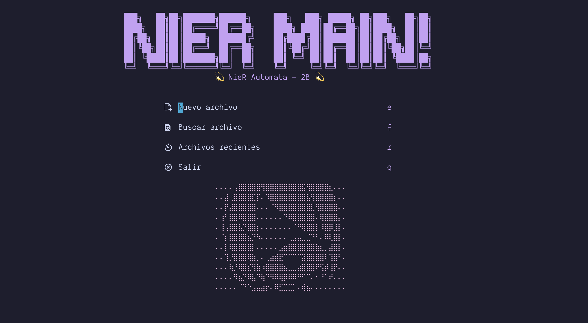

# NieR — Neovim config

Configuración para **Neovim 0.12+**, con NvChad UI, NvDash y tema Catppuccin
mediante base46.



## Instalación

Instala Neovim 0.12+, Git, Node.js con npm, Python 3 con pip y venv, un compilador
C/C++, `make`, `unzip`, `curl`, `ripgrep`, `fd` y `tree-sitter` CLI. Usa una Nerd
Font para los iconos. Las versiones de Neovim de algunos repositorios de Linux
pueden ser demasiado antiguas; comprueba `nvim --version`.

```sh
git clone https://github.com/EmmaG2/nvim-config ~/.config/nvim
nvim
```

Lazy instala los plugins y Mason los servidores enumerados en
`lua/lsp/mason.lua`. Espera a que terminen las instalaciones y reinicia Neovim.
`lazy-lock.json` fija las revisiones de los plugins: inclúyelo en Git y revisa
sus cambios al actualizar. `:Lazy restore` recupera esas revisiones.

Instala los formateadores desde Neovim:

```vim
:MasonInstall stylua clang-format black isort prettier terraform
```

Dependencias según lo que uses:

| Función | Dependencias adicionales |
| --- | --- |
| C/C++ | `clangd`; compilador y flags del proyecto |
| Ensamblador | `asm-lsp`; TASM/TLINK y DOSBox-X para las órdenes TASM |
| Java | JDK 21+ y `:MasonInstall jdtls` |
| Tests | pytest, Vitest o Jest instalados en el proyecto |
| Astro con Prettier | `prettier` y `prettier-plugin-astro` configurados en el proyecto |
| LazyGit | `lazygit` |
| Base de datos | `sqlit` |
| Requests HTTP | `curl`; `jq` para formatear respuestas JSON |
| Imágenes | Kitty y ImageMagick; librsvg para SVG |

Los binarios instalados por Mason se añaden al PATH dentro de Neovim.
No es necesario instalar los paquetes de `package.json` para usar el editor;
ese archivo contiene una herramienta auxiliar para mensajes de commits.

## Edición y lenguajes

- Telescope y NvimTree para navegar; Flash y Treesitter textobjects para moverse.
- nvim-cmp, LuaSnip y friendly-snippets para completar. Snippets propios de ASM
  en `LuaSnip/snippets/`.
- LSP para C/C++, ASM, Lua, Python, Java, JavaScript/TypeScript, Vue, Astro,
  HTML, CSS, Tailwind, Emmet y Terraform.
- Conform formatea al guardar. En buffers con ESLint, primero ejecuta
  `LspEslintFixAll` de forma síncrona y después el formateador, antes de escribir.
- Gitsigns, Fugitive y LazyGit para Git; Neotest para tests; Persistence y
  Undotree para sesiones e historial de cambios.

Para C/C++, proporciona `compile_commands.json` o `compile_flags.txt` según el
proyecto. Se conserva la detección de raíz de lspconfig, sin forzar el directorio
desde el que abriste Neovim. La plantilla usa `bits/stdc++.h`, que depende de
libstdc++ de GCC y no viene con Apple Clang/libc++; añadir una ruta de headers
genérica no lo soluciona.

Los archivos C++ nuevos quedan vacíos. Ejecuta `:CPTemplate` en un buffer C++
vacío para insertar la plantilla de programación competitiva. Rechaza buffers
con contenido para evitar sobrescribir trabajo.

TASM usa `/Applications/DOSBox-X.app/Contents/MacOS/dosbox-x` y
`~/assembly/tasm`; ajusta esas dos rutas en `lua/keymaps.lua` si tu instalación
es distinta. Los nombres de archivo deben cumplir la restricción DOS de ocho
caracteres indicada por la orden.

## Atajos

El líder es Espacio. Which-key muestra los atajos disponibles.

| Acción | Atajo |
| --- | --- |
| Guardar / cerrar ventana | `<leader>w` / `<leader>q` |
| Siguiente / anterior buffer | `<leader>bn` / `<leader>bp` |
| Explorador | `<leader>e` |
| Archivos / texto / buffers / recientes | `<leader>ff` / `fg` / `fb` / `fr` |
| División vertical / horizontal | `<leader>v` / `<leader>s` |
| Cambiar ventana | `Alt+h/j/k/l` |
| Inicio / fin de línea | `Ctrl+h` / `Ctrl+l` |
| Párrafo siguiente / anterior | `Ctrl+j` / `Ctrl+k` |
| Diagnóstico / siguiente / anterior | `<leader>d` / `<leader>n` / `<leader>p` |
| Renombrar símbolo | `<leader>r` |
| Formatear archivo o selección | `<leader>cf` |
| Salir de inserción | `jk` |
| Restaurar sesión actual / última | `<leader>qs` / `<leader>ql` |
| No guardar sesión | `<leader>qd` |
| Historial de undo | `<leader>u` |
| LazyGit | `<leader>gg` |
| Test cercano / archivo / todos | `<leader>tn` / `<leader>tf` / `<leader>ta` |
| Resumen de tests | `<leader>ts` |
| Compilar / ejecutar TASM | `<leader>ab` / `<leader>ar` |
| Ejecutar request HTTP | `<leader>hr` |
| Base de datos | `<leader>D` |

## Archivos principales

- `init.lua`: arranque y carga de módulos.
- `lua/basic.lua`, `keymaps.lua`, `autocmds.lua`: opciones, atajos y filetypes.
- `lua/plugins.lua`: plugins y sus configuraciones pequeñas.
- `lua/chadrc.lua`, `config/nvdash_gradient.lua`: interfaz y degradado del dashboard.
- `lua/cmp_settings.lua`: autocompletado.
- `lua/lsp/`: Mason y servidores.
- `lua/config/conform.lua`: formateo y orden de guardado.
- `templates/cp_template.cpp`: plantilla opcional de C++.

## Comprobaciones

```sh
nvim --clean --headless -l tests/config.lua
nvim --headless +qa
```

La prueba comprueba la plantilla y el orden ESLint → formato → escritura.
Con los plugins instalados, revisa `:checkhealth`, `:checkhealth vim.lsp` y
`:ConformInfo` para diagnosticar dependencias y servidores del proyecto actual.

## Autor y licencia

Emmanuel Granados. [Licencia MIT](LICENSE.md).
